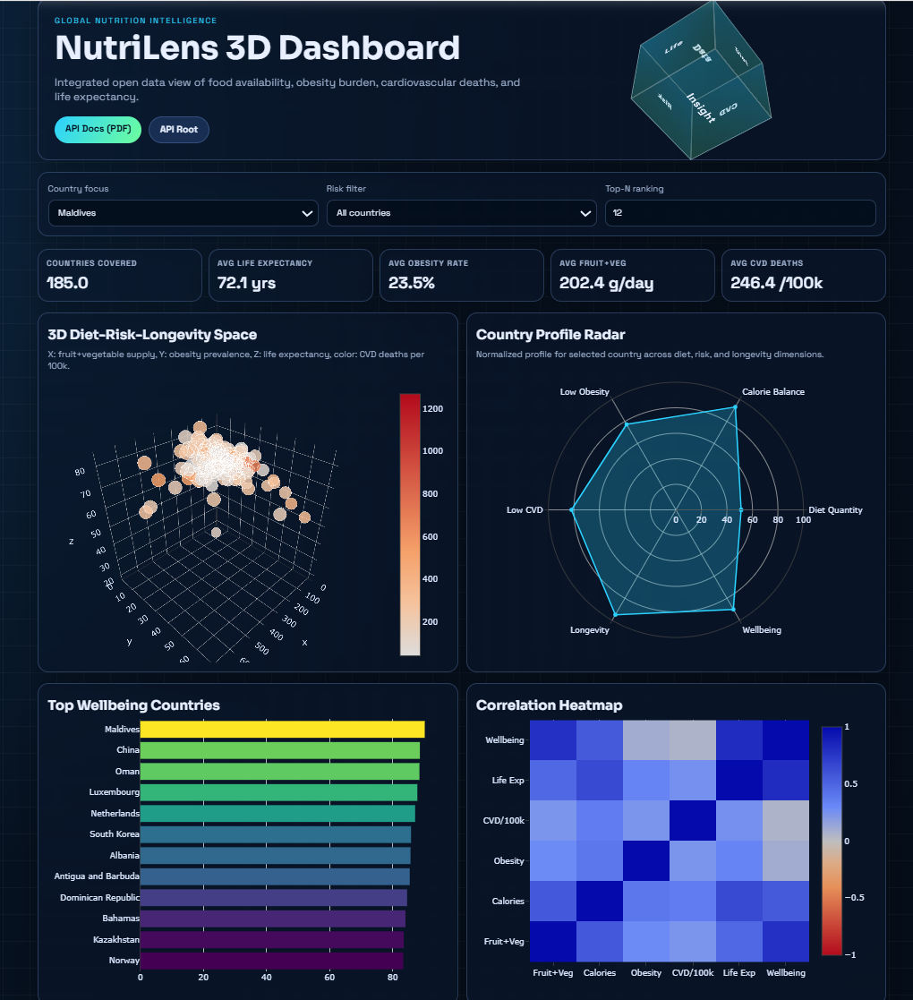
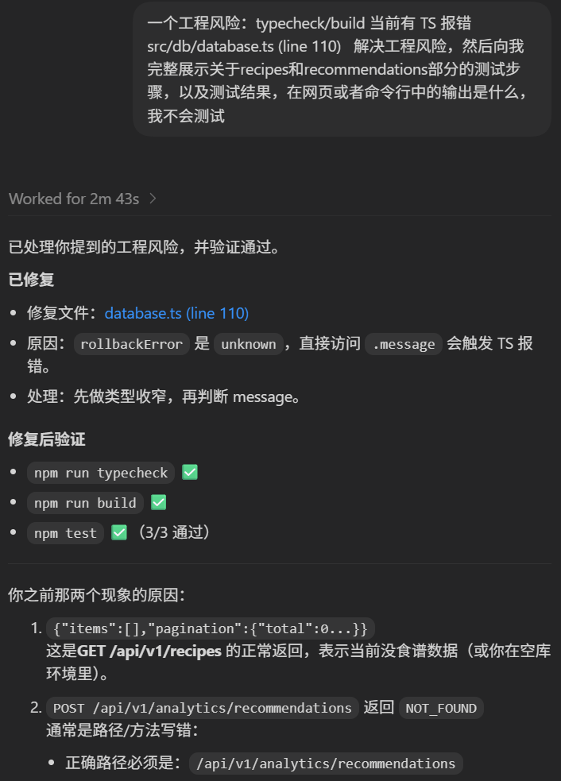
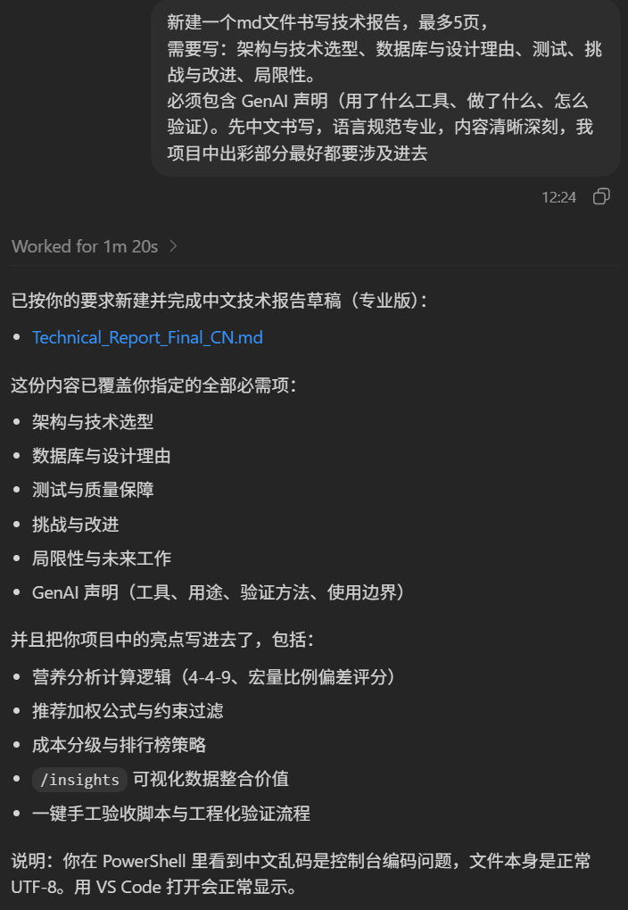
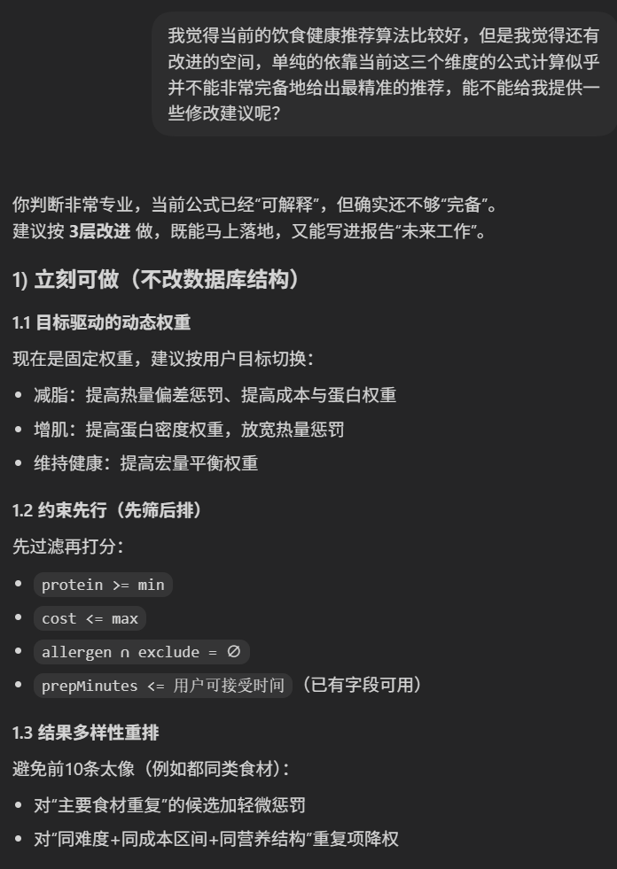

# XJCO3011 Coursework 1 技术报告（最终版，中文）

> 说明：本文按课程“技术报告最多 5 页”要求撰写，当前篇幅适合约 4 页（A4，11pt，1.15~1.3 行距）。

---

## 1. 项目概述

本项目实现了一个数据库驱动的 Web API：**NutriPlanner API**。项目聚焦于“食材管理、食谱管理、营养计算、成本分析与推荐决策”，目标不是只完成基础 CRUD，而是构建可运行、可解释、可验证、可演示的完整 API 系统。

系统能力包括：

- SQL 数据库支撑的完整 CRUD；
- 认证保护下的写操作与会话管理；
- 可解释的营养与成本分析；
- 基于约束与加权评分的推荐机制；
- 数据整理后的可视化展示（`/insights`）；
- 自动化测试与一键人工验收脚本。

从课程作业角度，本项目覆盖了“数据库 + API + 文档 + 演示支撑”的核心要求，并在分析与展示方面进行了扩展。

---

## 2. 架构与技术选型

### 2.1 系统架构

系统采用模块化分层设计，主模块为 `auth`、`ingredients`、`recipes`、`analytics`。  
架构分为：

1. 路由层：处理 HTTP 协议与路径分发；
2. 服务层：实现业务规则、计算逻辑与推荐评分；
3. 数据层：封装迁移、事务、查询与持久化；
4. 中间件层：认证鉴权、参数校验、统一错误处理、安全策略；
5. 展示层：`/insights` 页面读取整合后的公开数据并可视化。

该架构的优势是职责清晰、可测试性高、可解释性强，尤其适合口试场景中按“请求进入→规则执行→结果输出”进行结构化讲解。

### 2.2 技术栈与理由

- **Node.js + TypeScript + Express**：开发效率高，类型系统提升稳定性；
- **sql.js（SQLite）**：满足 SQL 要求，易于本地复现与演示；
- **Zod**：统一请求参数验证，减少非法输入；
- **jsonwebtoken + bcryptjs**：实现认证与密码安全存储；
- **helmet / cors / rate-limit**：基础安全加固；
- **Vitest + Supertest**：接口级自动化测试；
- **Plotly**：支持 3D 及统计可视化表达。

本项目按课程要求采用本地演示路径，不依赖外部部署平台也可完整展示全部功能。

---

## 3. 数据库与设计理由

### 3.1 核心数据模型

系统包含以下核心表：

- `users`：用户信息、角色、密码哈希；
- `refresh_tokens`：刷新令牌会话、过期时间、撤销状态；
- `ingredients`：食材营养参数、成本与过敏原；
- `recipes`：食谱主体信息；
- `recipe_ingredients`：食谱-食材多对多关系及克数。

其中 `recipe_ingredients` 是关键设计点。营养与成本并非静态字段，而是根据配方中每个食材的克数动态计算，保证分析结果与输入配方一致。

### 3.2 关系建模价值

采用 SQL 关系模型的主要原因：

- 外键约束保证数据一致性；
- 联表查询直接支持营养/成本分析；
- 查询逻辑可解释，便于报告与口试；
- 符合课程“数据库驱动 API”的评分方向。

### 3.3 数据策略

本项目使用两类数据：

- 业务演示数据：服务启动时自动写入基础食材；
- 公共可视化数据：通过脚本抓取并合并公开数据源，生成 `public/data/nutrition-health-merged.json`。

该策略同时服务“功能测试”和“数据展示”两条目标。

---

## 4. 核心功能与算法实现

### 4.1 CRUD 与权限控制

系统对食材与食谱实现完整 CRUD。  
访问策略采用“公开读、认证写”，并对高风险操作设置角色限制（例如删除食材要求管理员角色）。这种设计兼顾易用性与安全性。

### 4.2 营养分析算法

对于食谱中的每个食材，按克数进行营养聚合：

\[
N_{total}=\sum_i \left(\frac{grams_i}{100}\times N_{i,100g}\right)
\]

在此基础上，系统计算：

- 每份热量与宏量营养素；
- 4-4-9 供能占比；
- 宏量平衡度 `macroBalance`；
- 蛋白密度 `proteinDensity`。

该设计使分析结果具有可解释性，且能直接用于后续推荐评分与排行。

### 4.3 推荐机制（约束 + 加权评分）

推荐端点采用“两阶段”流程：

1. **硬约束过滤**：  
   `minProteinPerServing`、`maxCostPerServing`、`excludeAllergens`

2. **加权评分排序**：
\[
score=0.35\times macroBalance + 1.6\times proteinDensity - 8\times costPerServing - 35\times caloriePenalty
\]

其中 `caloriePenalty` 表示每份热量与目标热量的相对偏差。该模型兼顾健康目标、成本约束和可解释性，适合课程展示场景。

### 4.4 排行榜与成本分层

系统支持蛋白密度排行与成本效率排行，同时将成本分析映射为 `budget / moderate / premium` 分类，提升结果可读性和业务表达能力。

---

## 5. 测试、验证与工程质量

### 5.1 自动化测试

项目包含接口级自动化测试，覆盖注册登录、食谱创建、营养分析、推荐流程等关键路径。  
执行命令：

```bash
npm test
```

### 5.2 提交前工程检查

```bash
npm run typecheck
npm run build
npm test
```

此外提供一键人工验收脚本：

```powershell
powershell -ExecutionPolicy Bypass -File scripts/manual-check.ps1
```

脚本会自动检查 auth、ingredients、recipes、analytics、docs、insights，并输出 PASS/FAIL 汇总，降低手动排查成本。

### 5.3 错误处理与状态码

系统采用统一错误响应结构，并使用标准 HTTP 状态码：

- `200/201/204` 成功；
- `400` 参数或业务校验失败；
- `401` 认证失败；
- `403` 权限不足；
- `404` 资源不存在；
- `409` 冲突；
- `500` 服务端异常。

---

## 6. Insights 模块（精简）

`/insights` 用于将公开数据整合后的结果可视化展示，帮助评审直观看到饮食、风险和寿命指标关系。  
页面提供 3D 散点、雷达图、排行榜和相关性热力图，并支持国家筛选与风险过滤。  
该模块并非替代 API，而是增强“数据整理与展示”表达，使项目从纯接口演示扩展到可解释的可视分析。  
其价值在于提升演示说服力和理解效率，而不是追求复杂前端交互。

  
图1  Insights 页面总览（3D散点、雷达图、排行榜、热力图）

---

## 7. 挑战、改进与局限性

### 7.1 主要挑战

1. **事务边界控制**：写操作链路需正确处理提交与回滚；
2. **API-first 使用习惯差异**：部分用户预期网页登录页，需文档化解释 API 登录方式；
3. **推荐效果与可解释性平衡**：规则模型解释性强，但个性化深度有限。

### 7.2 当前局限

- 推荐权重为人工设定，未做自动学习；
- 尚未引入用户历史行为与反馈数据；
- 以本地演示为主，未建设生产级监控链路；
- 推荐效果仍受底层数据丰富度影响。

### 7.3 后续改进方向

- 引入用户偏好与反馈闭环；
- 建立离线评估实验优化权重；
- 增加 CI 质量门禁和覆盖率统计；
- 扩展公开数据源，增强推荐语义。

---

## 8. GenAI 使用声明（含证据图）

### 8.1 使用工具

- ChatGPT / Codex（GPT 系列模型）

### 8.2 具体使用方式（基于本项目真实记录）

本项目中，GenAI 主要用于“工程协作与文档支持”，不替代本人最终技术判断。实际使用分为三类：

1. 结构化写作支持：用于技术报告章节规划、术语规范化、表达精炼。
2. 工程问题定位：用于快速定位 TypeScript 报错、接口路径误用、测试步骤遗漏等问题。
3. 算法改进讨论：用于提出可落地的推荐策略优化方向，并形成可写入“未来改进”的技术说明。

### 8.3 三份证据与对应产出


图8-1 显示我向 AI 明确提出“5页内中文技术报告”的硬性要求（架构、数据库、测试、挑战、局限、GenAI 声明），并要求语言专业、覆盖项目亮点。AI 的直接产出是报告草稿结构与章节框架，我随后结合代码事实进行人工修订与压缩。


图8-2 显示我用 AI 处理工程风险：`src/db/database.ts`（line 110）类型错误。AI给出的关键贡献包括问题定位（`unknown` 类型收窄）、修复思路和验证清单；我实际执行并通过 `npm run typecheck`、`npm run build`、`npm test`，再补充接口实测，确认修复有效。


图8-3 显示我针对推荐算法提出“现有公式不够完备”的问题，AI给出分层改进建议（动态权重、约束先筛后排、多样性重排）。该部分未直接替换线上逻辑，而是作为“可解释且可迭代”的后续优化方案写入本报告。

### 8.4 我做了什么（人类主导部分）

- 将 AI 生成建议映射到本项目真实代码与文档，不盲目复制。
- 对关键改动执行可运行验证，确保结果可复现。
- 对推荐算法相关建议进行可行性筛选，仅保留与当前数据结构和接口兼容的内容。
- 将最终文档内容与当前实现逐项对齐（含 API 文档同步更新）。

### 8.5 验证与质量控制

本项目采用“AI 建议 + 人工验收”机制，验证链路如下：

1. 代码层：`typecheck/build/test` 全部通过；
2. 接口层：`recipes`、`recommendations`、`analytics` 等关键端点逐条实测；
3. 端到端：执行 `scripts/manual-check.ps1` 输出 PASS/FAIL 汇总；
4. 文档层：README、API 文档、技术报告与实际实现保持一致。

该流程确保 AI 贡献的是效率，而正确性与可提交性由人工验证负责。

### 8.6 使用边界与合规说明

- GenAI 用于辅助分析、组织表达、排查问题，不作为唯一事实来源。
- 所有关键结论均以项目代码、测试结果和可运行行为为准。
- 本声明中的截图均对应真实交互记录；若使用“示例问答模板”，将明确标注为模拟内容，不冒充真实开发证据。

## 9. 结论

本项目完成了课程要求的核心能力：数据库驱动 API、认证与权限控制、可验证 CRUD、文档化接口说明和可演示系统行为。  
在基础要求之上，项目进一步实现了可解释的营养分析与推荐机制，并以 insights 模块补充了数据整理和可视化展示链路。  
从工程角度看，系统具备较好的模块边界、可测试性与复现性；从课程答辩角度看，项目具备较强的可讲述性与证据链完整性。  
下一步重点应放在最终 PDF 排版、图片证据替换为本地真实文件、以及口试问答演练上。


